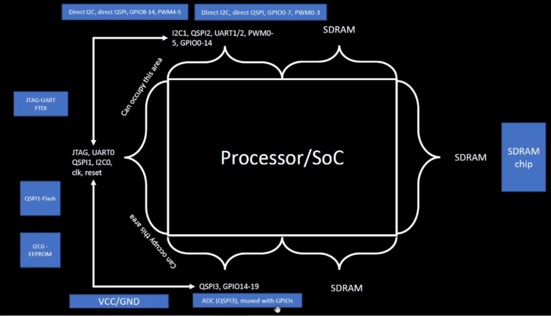

# Day 1 - Inception of open-source EDA, OpenLANE and Sky130 PDK

## Introduction to Chip Design
## Chip Components

**Pads**
Pads are used to transfer signals between the external environment and the internal circuitry of the chip.

**Core**
The core is the region where all standard cells and logic gates are placed and interconnected.

**Die**
The die represents the entire silicon area of the chip and defines its physical size.

## RISC-V SoC Overview

A RISC-V SoC typically consists of components such as:
**SRAM
SoC logic
ADC
DAC
SPI
**
These components are referred to as Foundry IPs. Chip fabrication depends on the foundry, where processes such as deposition and lithography are used.
[Screenshot 16-02-46](Day-1/Images/Screenshot 2025-12-14 215311.png)

📗 Introduction to RISC-V

RISC-V is an open-standard Instruction Set Architecture (ISA) based on Reduced Instruction Set Computing (RISC) principles. The term “V” denotes the fifth generation of RISC architecture developed at UC Berkeley.

Key Features:

Open-source with no licensing fees

Fixed 32-bit instruction format

Supports both 32-bit and 64-bit address spaces

Extensible instruction set

Broad industry and academic support

Chips are physically connected to packages using bond wires.

📷

🔄 From Software Applications to Hardware
🖥️ Software-to-Hardware Flow

Applications pass through several abstraction layers before execution on hardware:

Operating System
Handles memory management and I/O operations.

Compiler
Converts high-level languages (C, C++, Java) into assembly instructions.

Assembler
Translates assembly code into binary machine instructions.

Instructions act as the interface between software and hardware, allowing the processor to execute tasks.

📷

🧩 SoC Design and OpenLANE

To design a Digital ASIC, three essential elements are required:

RTL Design

EDA Tools

PDK Data

🔹 What is RTL Design?

Register Transfer Level (RTL) describes digital circuits in terms of data flow between registers and logical operations. RTL is written using HDL languages such as Verilog or VHDL.

🔗 Open-source RTL resources:

librecores.org

opencores.org

github.com

🔹 What are EDA Tools?

Electronic Design Automation (EDA) tools assist in designing, simulating, verifying, and fabricating ICs.

Popular open-source EDA tools include:

OpenLANE

OpenROAD

Qflow

🔹 What is PDK Data?

PDK (Process Design Kit) acts as the interface between design and fabrication.

It includes:

Design rules (DRC, LVS, REX)

Standard cell libraries

I/O libraries

In 2020, Google released the Sky130 open-source PDK using SkyWater technology.

💡 Even older nodes like 130 nm remain powerful:

Intel Pentium 4 EE (3.46 GHz, 2004)

Sky130 RV32i single-cycle CPU can exceed 1 GHz

🔁 Simplified RTL-to-GDS Flow

📷

Step 1: Synthesis

RTL is converted into a gate-level netlist using standard cell libraries.

Step 2: Floorplanning & Power Planning

Defines die and core dimensions

Places I/O pads

Builds power grid (VDD & GND)

Uses upper metal layers to reduce resistance and EM issues

Step 3: Placement

Global Placement: Approximate cell positioning

Detailed Placement: Exact legal placement and optimization

Step 4: Clock Tree Synthesis (CTS)

Distributes the clock signal evenly to minimize skew.

Step 5: Routing

Global Routing: Routing guides

Detailed Routing: Final wire connections

Step 6: Sign-Off

DRC (Design Rule Check)

LVS (Layout vs Schematic)

STA (Static Timing Analysis)

🛠️ What is OpenLANE?

OpenLANE is an automated RTL-to-GDSII flow composed of multiple open-source tools:

OpenROAD

Yosys

Magic

Netgen

OpenSTA

KLayout

🎯 OpenLANE Goals:

No human intervention

Clean GDSII output

Zero DRC, LVS, and timing violations

OpenLANE is optimized for the Sky130 PDK and supports both:

Interactive mode

Automated mode

🧬 OpenLANE ASIC Design Flow

📷

Key Stages:

Floorplanning & Power Planning

Tap Cell & Decap Insertion

Placement & Optimization

CTS

Routing

Verification

Every netlist modification is verified using Logical Equivalence Checking (LEC) via Yosys.

⚠️ Antenna Rule Violations

Long metal wires can accumulate charge during fabrication, damaging transistor gates.

Solutions:

Wire segmentation

Higher metal layer bridges

Antenna diode insertion

OpenLANE automatically inserts fake diodes during placement and replaces them if violations are detected.

⏱️ Static Timing Analysis (STA)

RC extraction using DEF2SPEF

Timing analysis using OpenSTA

Reports setup/hold violations

🔍 Physical Verification

DRC: Magic

LVS: Magic + Netgen

SPICE extraction: Magic

📁 OpenLANE Directory Structure

Using sky130_fd_sc_hd PDK:

sky130 → process node

fd → foundry (SkyWater)

sc → standard cells

hd → high-density variant

Includes files:

LEF, GDS, LIB, CDL, SPICE, MAG, TECHLEF

🚀 Design Preparation Step

Start OpenLANE in interactive mode and prepare the design:

prep -design picorv32a

📷

🧪 Synthesis and Review

After preparation:

A run directory is created

temp/merged.lef contains layout info

Reports stored under reports/

Results stored under results/

Run Synthesis:
run_synthesis

📷

📊 Synthesis Results:

Flip-flops: 1613

Total cells: 14876

Flop Ratio: 10.84%

📷

