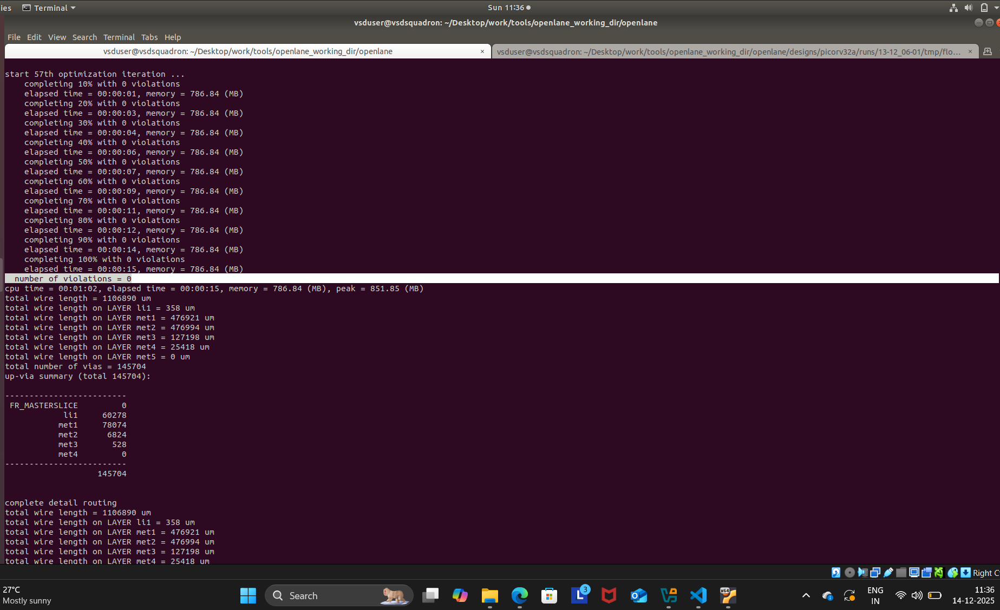
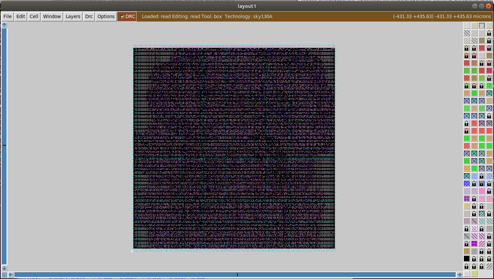
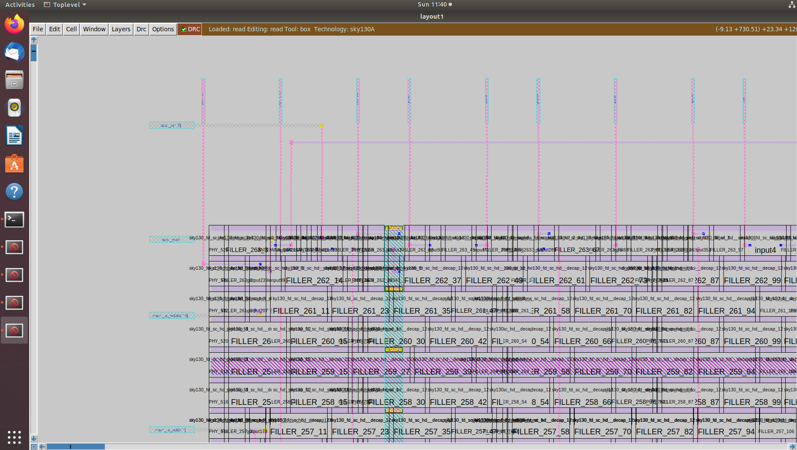
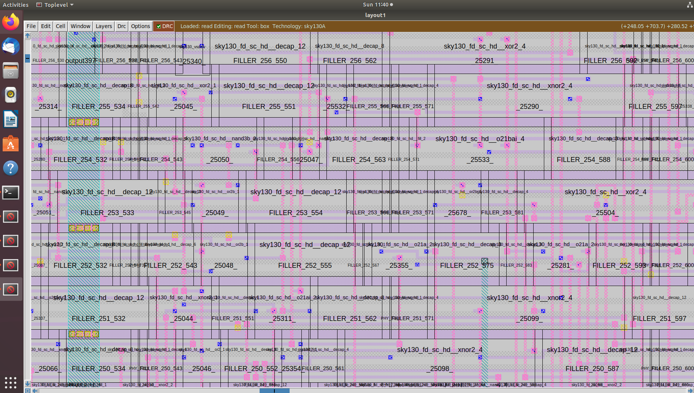
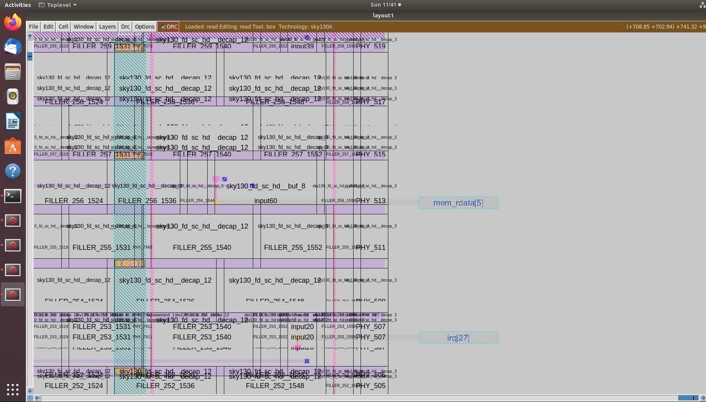
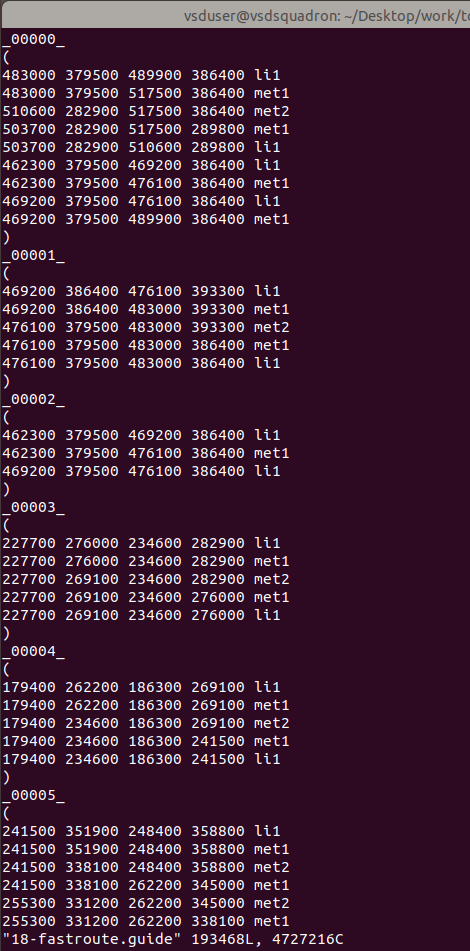
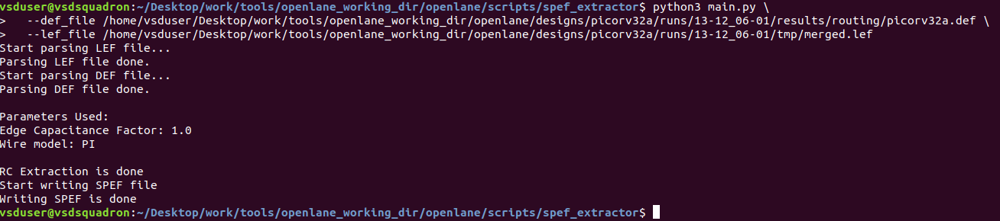
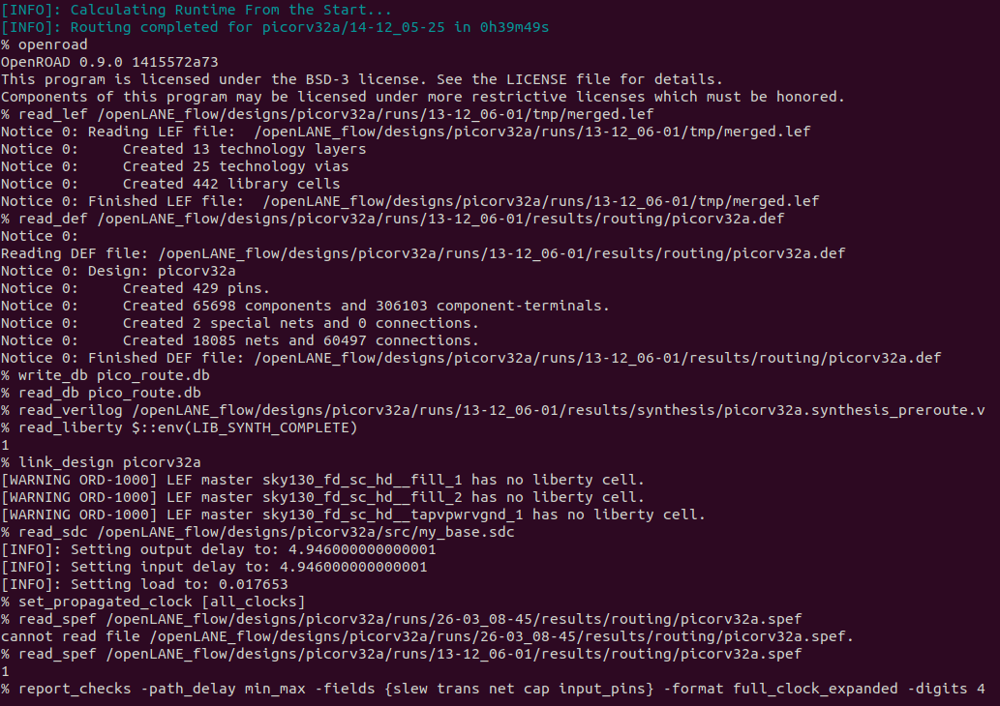
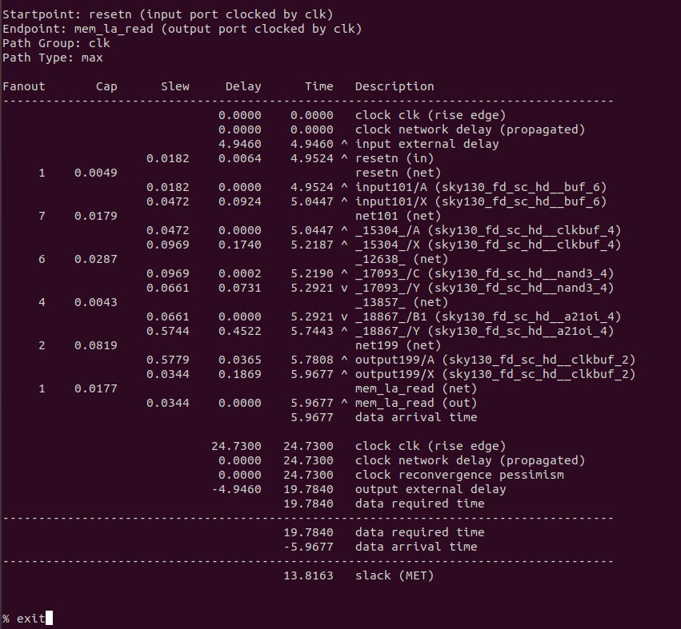

## Day 5 - Final steps for RTL2GDS using tritonRoute and openSTA
## Author : Goutham Badhrinath V

### Theory

### Implementation

* Day 5 tasks:-
1. Perform generation of Power Distribution Network (PDN) and explore the PDN layout.
2. Perfrom detailed routing using TritonRoute.
3. Post-Route parasitic extraction using SPEF extractor.
4. Post-Route OpenSTA timing analysis with the extracted parasitics of the route.

#### 1. Perform generation of Power Distribution Network (PDN) and explore the PDN layout.

Commands to perform all necessary stages up until now

```bash
# Change directory to openlane flow directory
cd Desktop/work/tools/openlane_working_dir/openlane

# alias docker='docker run -it -v $(pwd):/openLANE_flow -v $PDK_ROOT:$PDK_ROOT -e PDK_ROOT=$PDK_ROOT -u $(id -u $USER):$(id -g $USER) efabless/openlane:v0.21'
# Since we have aliased the long command to 'docker' we can invoke the OpenLANE flow docker sub-system by just running this command
docker
```
```tcl
# Now that we have entered the OpenLANE flow contained docker sub-system we can invoke the OpenLANE flow in the Interactive mode using the following command
./flow.tcl -interactive

# Now that OpenLANE flow is open we have to input the required packages for proper functionality of the OpenLANE flow
package require openlane 0.9

# Now the OpenLANE flow is ready to run any design and initially we have to prep the design creating some necessary files and directories for running a specific design which in our case is 'picorv32a'
prep -design picorv32a

# Addiitional commands to include newly added lef to openlane flow merged.lef
set lefs [glob $::env(DESIGN_DIR)/src/*.lef]
add_lefs -src $lefs

# Command to set new value for SYNTH_STRATEGY
set ::env(SYNTH_STRATEGY) "DELAY 3"

# Command to set new value for SYNTH_SIZING
set ::env(SYNTH_SIZING) 1

# Now that the design is prepped and ready, we can run synthesis using following command
run_synthesis

# Following commands are alltogather sourced in "run_floorplan" command
init_floorplan
place_io
tap_decap_or

# Now we are ready to run placement
run_placement

# Incase getting error
unset ::env(LIB_CTS)

# With placement done we are now ready to run CTS
run_cts

# Now that CTS is done we can do power distribution network
gen_pdn 
```

Screenshots of power distribution network run


Commands to load PDN def in magic in another terminal

```bash
# Change directory to path containing generated PDN def
cd Desktop/work/tools/openlane_working_dir/openlane/designs/picorv32a/runs/13-12_06-01/tmp/floorplan/

# Command to load the PDN def in magic tool
magic -T /home/vsduser/Desktop/work/tools/openlane_working_dir/pdks/sky130A/libs.tech/magic/sky130A.tech lef read ../../tmp/merged.lef def read 17-pdn.def &
```

Screenshots of PDN def


#### 2. Perfrom detailed routing using TritonRoute and explore the routed layout.

Command to perform routing

```tcl
# Check value of 'CURRENT_DEF'
echo $::env(CURRENT_DEF)

# Check value of 'ROUTING_STRATEGY'
echo $::env(ROUTING_STRATEGY)

# Command for detailed route using TritonRoute
run_routing
```

Screenshots of routing run





Commands to load routed def in magic in another terminal

```bash
# Change directory to path containing routed def
cd Desktop/work/tools/openlane_working_dir/openlane/designs/picorv32a/runs/13-12_06-01/results/routing/

# Command to load the routed def in magic tool
magic -T /home/vsduser/Desktop/work/tools/openlane_working_dir/pdks/sky130A/libs.tech/magic/sky130A.tech lef read ../../tmp/merged.lef def read picorv32a.def &
```

Screenshots of routed def






Screenshot of fast route guide present in `openlane/designs/picorv32a/runs/13-12_06-01/tmp/routing` directory



#### 3. Post-Route parasitic extraction using SPEF extractor.

Commands for SPEF extraction using external tool

```bash
# Change directory
cd Desktop/work/tools/openlane_working_dir/openlane/scripts/spef_extractor

# Command extract spef
python3 main.py \
  --def_file /home/vsduser/Desktop/work/tools/openlane_working_dir/openlane/designs/picorv32a/runs/13-12_06-01/results/routing/picorv32a.def \
  --lef_file /home/vsduser/Desktop/work/tools/openlane_working_dir/openlane/designs/picorv32a/runs/13-12_06-01/tmp/merged.lef
```


#### 4. Post-Route OpenSTA timing analysis with the extracted parasitics of the route.

Commands to be run in OpenLANE flow to do OpenROAD timing analysis with integrated OpenSTA in OpenROAD

```tcl
# Command to run OpenROAD tool
openroad

# Reading lef file
read_lef /openLANE_flow/designs/picorv32a/runs/13-12_06-01/tmp/merged.lef

# Reading def file
read_def /openLANE_flow/designs/picorv32a/runs/13-12_06-01/results/routing/picorv32a.def

# Creating an OpenROAD database to work with
write_db pico_route.db

# Loading the created database in OpenROAD
read_db pico_route.db

# Read netlist post CTS
read_verilog /openLANE_flow/designs/picorv32a/runs/13-12_06-01/results/synthesis/picorv32a.synthesis_preroute.v

# Read library for design
read_liberty $::env(LIB_SYNTH_COMPLETE)

# Link design and library
link_design picorv32a

# Read in the custom sdc we created
read_sdc /openLANE_flow/designs/picorv32a/src/my_base.sdc

# Setting all cloks as propagated clocks
set_propagated_clock [all_clocks]

# Read SPEF
read_spef /openLANE_flow/designs/picorv32a/runs/13-12_06-01/results/routing/picorv32a.spef

# Generating custom timing report
report_checks -path_delay min_max -fields {slew trans net cap input_pins} -format full_clock_expanded -digits 4

# Exit to OpenLANE flow
exit
```

Screenshots of commands run and timing report generated




# Acknowledgements

* [Kunal Ghosh](https://github.com/kunalg123), Co-founder, VSD Corp. Pvt. Ltd.

  
